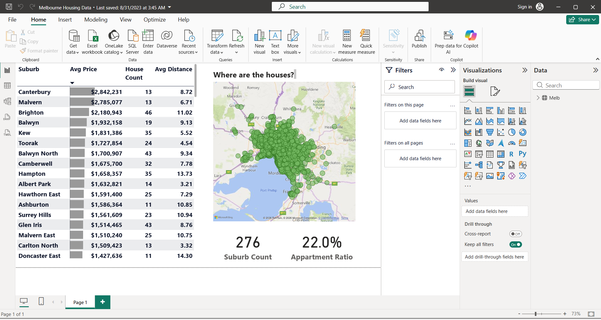
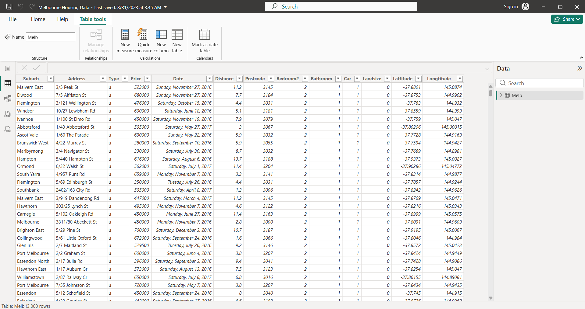
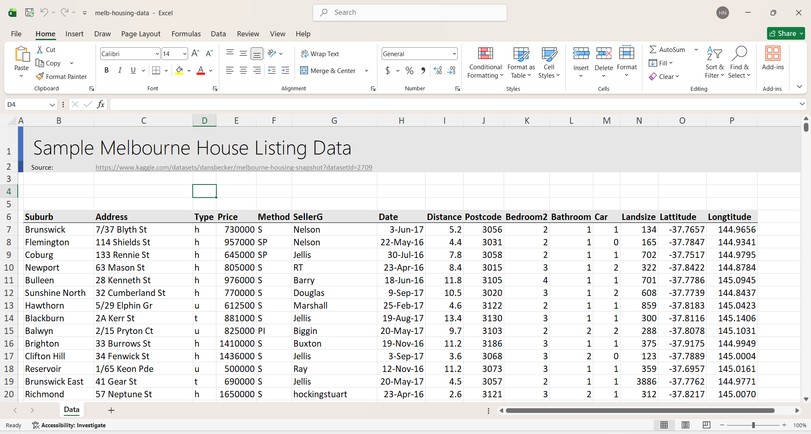

# Melbourne Housing Data Analysis Dashboard

## Description

A Power BI dashboard built using the Melbourne Housing Dataset to analyze housing prices, suburb statistics, property distribution, and housing trends across Melbourne. The dashboard provides interactive visualizations to help explore real estate patterns and key housing metrics.

## Features

* Average house prices by suburb
* House count analysis
* Property location mapping
* Distance-based housing insights
* Apartment ratio calculation
* Interactive Power BI visualizations

## Dataset

The dataset contains Melbourne housing listings, including:

* Suburb
* Address
* Property Type
* Price
* Date Sold
* Distance from CBD
* Bedrooms
* Bathrooms
* Car Spaces
* Land Size
* Latitude & Longitude

## Tools Used

* Microsoft Excel (Data Source)
* Power BI Desktop
* DAX
* Power Query

## Screenshots

### Dashboard Preview



### Data View






## Project Structure

```text
Melbourne-Housing-Dashboard/
│
├── Melbourne Housing Dashboard.pbix
├── melb-housing-data.xlsx
├── screenshots/
│   ├── dataset.png
│   ├── data-view.png
│   └── dashboard.png
└── README.md
```
## Author

**Hamid Nawaz**

* Computer Science Student
* Data Analytics & Business Intelligence Enthusiast
* Power BI Developer


## Connect With Me

- LinkedIn: www.linkedin.com/in/
- Fiverr: [https://www.fiverr.com/your-username](https://www.fiverr.com/s/e6D4d4E)
- Email: hamidsherani2172@gmail.com
